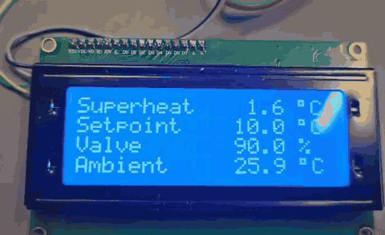
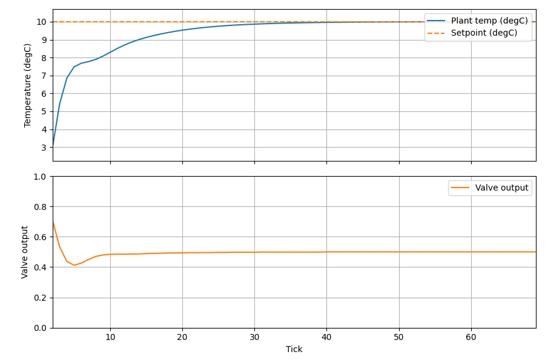
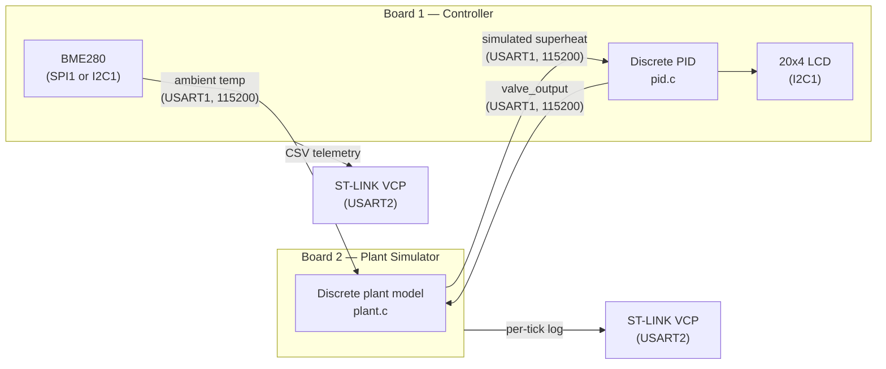
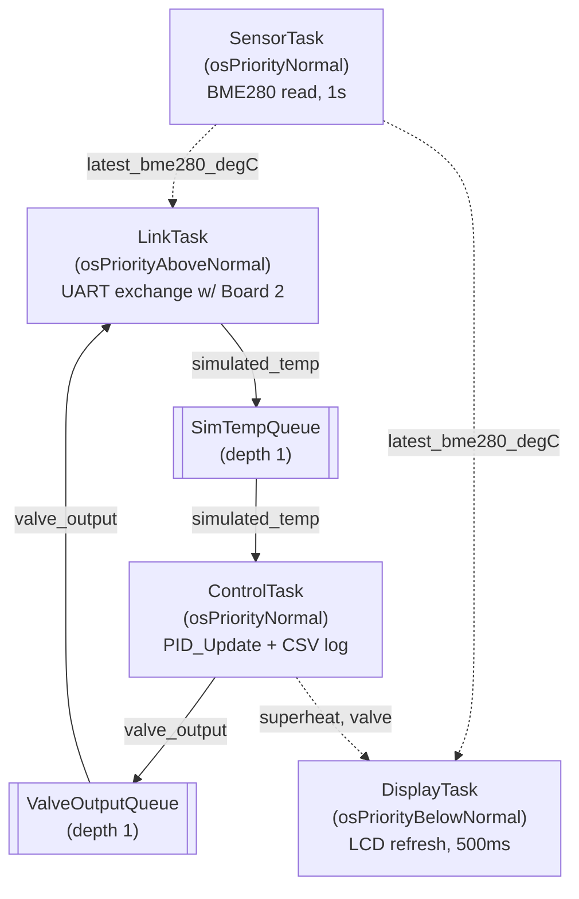

# Superheat Control — Hardware-in-the-Loop PID Controller

A two-board Hardware-in-the-Loop (HIL) refrigeration superheat controller built on
STM32 Nucleo-F401RE boards. In the absence of a physical expansion valve and
evaporator, a second Nucleo runs a discretized transfer-function model of the
plant, closing a real control loop over a live inter-board link.



*Board 1's 20x4 LCD running on the hardware rig: simulated superheat held at
the 10 °C setpoint, the valve opening the PI controller is commanding, and
the real ambient temperature from the BME280.
[Full demo video](docs/videos/lcd_demo.mp4).*



*Simulated superheat converging to a 10°C setpoint under discrete PID control
(Kp=0.1, Ki=0.015), with the corresponding valve opening (%) settling to
steady state. Captured live from Board 1's UART debug stream — see
[Plotting the control loop](#plotting-the-control-loop).*

## Architecture

| | Board 1 — Controller | Board 2 — Plant Simulator |
|---|---|---|
| Folder | `Superheat_Control/` | `HVACPlant/` |
| Role | Runs the discrete PID loop, measures real ambient temperature, drives the LCD | Runs a discretized transfer-function model of the refrigeration plant |
| Sensor | BME280 over SPI1 *or* I2C1 (build option) — ambient temperature, fed to the plant as a load disturbance | None |
| Display | 20x4 HD44780 LCD (2004A) with PCF8574 I2C backpack (I2C1) | None |
| Debug output | USART2 → ST-LINK VCP (CSV telemetry) | USART2 → ST-LINK VCP (per-tick log) |
| Inter-board link | USART1 (PA9/PA10), master side | USART1 (PA9/PA10), replies to each frame |

Board 1 sends `valve_output` and the measured ambient temperature to Board 2
every control cycle; Board 2 runs them through the plant model and replies
with the resulting simulated superheat, which becomes the PID's measurement
input. This makes the HIL loop a genuine closed loop — the controller board
never sees the "real" plant, only what the second board computes and sends
back over the wire.



### Control loop

- Discrete PID: `pid.c` / `pid.h` — parallel P+I form with output clamping
  (anti-windup), `Kp=0.1`, `Ki=0.015`, `Kd=0`, sample time `Ts=1.0s`.
- Discrete plant model: `plant.c` / `plant.h` — `y[n] = den*y[n-1] + num*u[n-1] + num_d*d[n-1]`,
  implementing `3.2739 / (z - 0.8363)` at `Ts=1.0s` (re-discretized from a
  continuous model with `tau≈5.594s`, `K=20.0`, originally tuned at `Ts=0.01s`
  in Simulink), plus the ambient disturbance below.

### Ambient temperature as a load disturbance

A warmer room raises the evaporator's heat load, which pushes superheat up.
Board 1's BME280 measures the real room temperature and Board 2 feeds the
deviation from a 22 °C reference into the plant through the same first-order
lag as the valve: `Gd(s) = Kd/(tau*s + 1)` with `Kd = 0.5` °C superheat per
°C ambient, discretized with the plant's pole so `num_d = Kd*(1 - den)`.

The controller never sees the ambient reading — it has to reject the
disturbance purely from its effect on superheat, as it would on a real plant.
Warming the sensor with a hand (≈ +8 °C) lifts superheat by roughly 1 °C
before the PI loop pulls it back to the setpoint in about 20 s, closing the
valve from 50 % to 30 % to compensate; letting go produces the mirror image.
`tools/plot_live.py` shows the ambient trace underneath the loop response.

If the sensor is missing or a read fails, Board 1 sends no ambient field and
Board 2 holds the last disturbance it received rather than stepping back to
zero.

### Inter-board link protocol

Plain ASCII CSV over USART1 at 115200 baud. Board 1 → Board 2:
`"<tick>,<valve>,<ambient_degC>\r\n"` (the ambient field is omitted when there
is no valid reading). Board 2 → Board 1: `"<tick>,<superheat>\r\n"`.
Deliberately kept separate from USART2, which is reserved on both boards for
ST-LINK VCP debug logging.

## BME280 over SPI or I2C

The sensor driver (`bme280.c`) only needs register-level read and write, so it
talks to the chip through a small bus interface (`BME280_Bus_t` in
`bme280.h`). `bme280_bus_spi.c` and `bme280_bus_i2c.c` each implement it; the
chip-ID check, calibration read and temperature compensation above them are
identical for both. The bus is chosen at build time:

```
cmake --preset Debug                  # SPI (default)
cmake --preset Debug -DBME280_BUS=I2C # I2C, sharing I2C1 with the LCD
```

The startup log reports which bus is in use (`# BME280 over I2C, chip_id=0x60`).

## LCD display

A 20x4 HD44780 character LCD (2004A) on a PCF8574 I2C backpack (`lcd2004.c`) shows
the live loop state, refreshed every 500 ms:

```
Superheat   10.2 °C
Setpoint    10.0 °C
Valve       50.0 %
Ambient     23.4 °C
```

Values that aren't available yet (no reply from Board 2, or no BME280) show
as `--.-`. The 20x4 panel is addressed as two 40-character HD44780 lines
split in half, so rows 0-3 start at DDRAM 0x00, 0x40, 0x14 and 0x54.

The HD44780 runs in 4-bit mode: the PCF8574's eight outputs carry one data
nibble plus RS/RW/EN/backlight. The controller samples RS on EN's rising edge
and latches data on the falling edge, so each nibble is three PCF8574 writes:
data and RS with EN low, then EN high, then EN low. Every LCD byte is one
six-byte I2C transaction. An earlier version raised EN in the same write that
changed RS, which occasionally latched the wrong RS: characters ran as
commands (turning the display off and on) and commands printed as text. It's driven from its own lowest-priority `DisplayTask`, so the
operator display can never delay the control or link tasks. If nothing
answers at the LCD's address at startup, the task logs it and exits.

### Sharing I2C1 between tasks

In the I2C build, `SensorTask` (BME280) and `DisplayTask` (LCD) both use
I2C1, and the HAL's I2C handle isn't safe to use from two tasks at once.
`i2c1_bus.c` owns the bus and wraps every transfer in a FreeRTOS mutex with
priority inheritance, so a transaction is never interleaved with another and
the low-priority display task can't hold up the sensor task through priority
inversion.

## Interrupt-driven UART reception

The inter-board link originally used polling (`HAL_UART_Receive` in a
byte-by-byte loop). This worked most of the time but intermittently corrupted
frames — worse under load (e.g. right after adding per-tick debug printing).

**Root cause:** the STM32 UART peripheral buffers exactly one received byte.
Polling only protects that byte if the CPU happens to be inside the polling
call at the exact moment it arrives. Any time the CPU was elsewhere — running
`printf`, computing the plant update — a byte landing during that window was
silently overwritten (receive overrun) before anything read it out, corrupting
that line's framing.

**Fix:** both boards now arm `HAL_UART_Receive_IT` once at startup and
assemble each line inside `HAL_UART_RxCpltCallback`, which the UART hardware
interrupt guarantees will run the instant a byte arrives — regardless of what
the main loop is doing. The callback appends the byte to a line buffer,
flags a complete line on `\n`, and immediately re-arms the next single-byte
receive before returning. The main loop's `Link_ReceiveLine` just waits on
that flag with a timeout, instead of touching bytes directly. This removed the
CPU-availability race entirely rather than just improving its odds.

## FreeRTOS task split (Board 1)

Board 1 originally ran a single bare-metal superloop doing everything
sequentially: BME280 read, UART link exchange, PID update, debug print. It now
runs three FreeRTOS (CMSIS-RTOS v2) tasks instead, connected by two depth-1
message queues that always hold the latest value:

- **`SensorTask`** — reads the BME280 once per second, independent of the
  control loop's timing.
- **`LinkTask`** (`osPriorityAboveNormal`) — sends `valve_output` and the
  latest ambient reading to Board 2, waits for its reply, and pushes the
  result into `SimTempQueue`.
- **`ControlTask`** — reads `SimTempQueue`, runs `PID_Update`, pushes the new
  `valve_output` into `ValveOutputQueue`, and prints the CSV debug line.
- **`DisplayTask`** (`osPriorityBelowNormal`) — refreshes the LCD every
  500 ms. Created in user code rather than CubeMX.

The latest ambient reading and the values shown on the LCD are shared as
`volatile float`s rather than through queues: each has one writer, and an
aligned 32-bit access is atomic on the Cortex-M4, so a reader can never see
a half-written value. (A `double` would need two accesses and could tear.)



Two issues surfaced while bringing this up, both worth knowing if you extend
this further:

- **Missing NVIC priority grouping.** `HAL_MspInit` never called
  `HAL_NVIC_SetPriorityGrouping(NVIC_PRIORITYGROUP_4)`. FreeRTOS's Cortex-M
  port assumes 4 preemption-priority bits; running on the CPU's reset default
  silently broke interrupt masking, producing zero serial output with no
  error of any kind.
- **Stack overflow in `LinkTask`.** `sscanf`/`snprintf` float formatting in
  newlib-nano is stack-heavy, more than bare-metal's single large shared stack
  ever made obvious. `configCHECK_FOR_STACK_OVERFLOW` and a
  `vApplicationStackOverflowHook` were added to surface this instead of
  silently corrupting memory; `LinkTask`/`ControlTask`/`DisplayTask` are now sized
  to 512 words, `SensorTask` to 256.

`Link_ReceiveLine`'s wait loop also switched from a bare spin to `osDelay(1)`
per iteration — `LinkTask` runs at the highest priority, so a non-yielding
spin there starved the other two tasks entirely after their first cycle.

## Repository layout

```
Superheat_Control_Project/
├── Superheat_Control/   Board 1 (Controller) — STM32CubeIDE/CMake project
├── HVACPlant/           Board 2 (Plant Simulator) — STM32CubeIDE/CMake project
├── tools/               Host-side Python scripts for live plotting & logging
│   └── logs/            Timestamped CSV logs from tools/plot_live.py (gitignored)
└── docs/images/         Figures used in this README
```

## Building and flashing

Both projects are STM32CubeIDE/CMake projects using the STM32Cube-bundled
`arm-none-eabi-gcc` toolchain and Ninja. Open each folder in an IDE with CMake
Tools + Cortex-Debug (or STM32CubeIDE directly), build, and flash over each
board's onboard ST-LINK.

Flash and reset **both boards together** after any rebuild — if one board is
reflashed while the other keeps running, their tick counters and link framing
can start from different states.

## Wiring

| Board 1 (Controller) pin | Board 2 (Plant Simulator) pin | Purpose |
|---|---|---|
| D8 (PA9, USART1_TX) | D2 (PA10, USART1_RX) | Board 1 → Board 2 |
| D2 (PA10, USART1_RX) | D8 (PA9, USART1_TX) | Board 2 → Board 1 |
| GND | GND | Common reference |

Board 2 is powered externally (E5V via CN7 pin 6, JP5 jumper moved to the E5V
position, JP1 removed) since it has no USB connection of its own in the HIL
setup.

### Board 1 peripherals

| Device | Board 1 pin | Device pin |
|---|---|---|
| BME280, SPI build | D13 (PA5, SPI1_SCK) | SCL/SCK |
| | D12 (PA6, SPI1_MISO) | SDO |
| | D11 (PA7, SPI1_MOSI) | SDA/SDI |
| | D10 (PB6, GPIO) | CSB |
| BME280, I2C build | D15 (PB8, I2C1_SCL) | SCL/SCK |
| | D14 (PB9, I2C1_SDA) | SDA/SDI |
| | 3V3 | CSB (must be high at power-up, or the chip latches into SPI mode) |
| | GND | SDO (address 0x76; tie to 3V3 for 0x77) |
| LCD backpack | D15 (PB8, I2C1_SCL) | SCL |
| | D14 (PB9, I2C1_SDA) | SDA |
| | 5V | VCC |

All I2C devices share the same two wires, plus 3V3/5V and GND. The LCD's
backpack pulls SDA/SCL up to 5V; PB8/PB9 are 5V-tolerant, but most BME280
breakouts aren't unless they have an onboard level shifter. When both are on
the bus, use a BME280 board with a level shifter, remove the backpack's
pull-up resistors, or put a bidirectional level shifter between them.

## Plotting the control loop

`tools/plot_live.py` reads Board 1's USART2 debug stream (ST-LINK VCP) live,
plots plant temperature vs. setpoint and valve output in real time, and logs
every row to a timestamped CSV in `tools/logs/`.

```
pip install pyserial matplotlib
python tools/plot_live.py COM4      # replace COM4 with Board 1's ST-LINK VCP port
```

To regenerate a static plot (e.g. for a report) from a saved log:

```
python tools/plot_from_log.py tools/logs/run_20260926_151558.csv --out step_response.png
```
